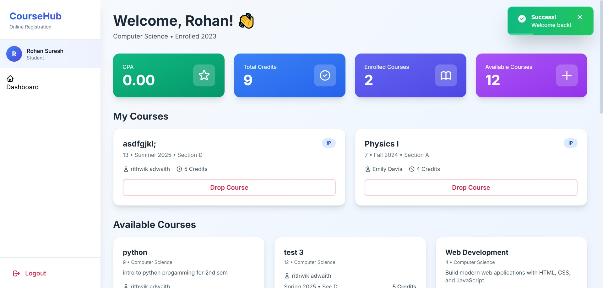
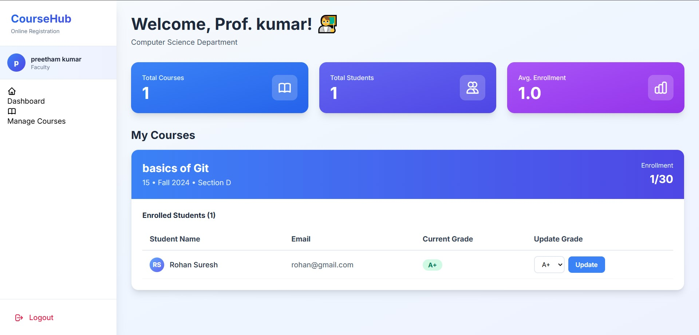
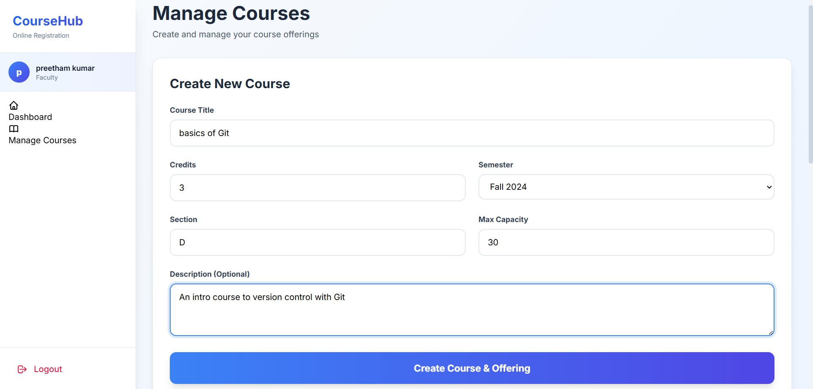

# CourseHub - Online Course Registration System

A modern, elegant online course registration system built with Flask, MySQL, and TailwindCSS.

# Demo

Below are some preview images of the CourseHub system:







---

## Features

### For Students

* 📚 Browse available courses with real-time seat availability
* ✅ Enroll in courses instantly
* 📊 Track enrolled courses and grades
* 💳 View total credits earned
* 🎯 Modern, intuitive dashboard

### For Faculty

* 👨‍🏫 Create and manage courses
* 📝 Grade students efficiently
* 📈 View enrollment statistics
* 👥 Manage student rosters
* 🎓 Track course performance

## Technology Stack

* **Backend**: Flask (Python)
* **Database**: MySQL
* **Frontend**: HTML, TailwindCSS
* **Authentication**: SHA-256 password hashing
* **Session Management**: Flask sessions

## Installation

### Prerequisites

* Python 3.8+
* MySQL 8.0+
* pip

### Setup Steps

1. **Clone the repository**

   ```bash
   cd DBMS-mini-project
   ```

2. **Install Python dependencies**

   ```bash
   pip install -r requirements.txt
   ```

3. **Set up the database**

   * Open MySQL and run:

   ```bash
   mysql -u root -p < setup_database.sql
   ```

   This will create the database, tables, and sample data.

4. **Install database objects (Functions, Procedures, Triggers)**

   ```bash
   mysql -u root -p course_registration < database_objects.sql
   ```

   This adds advanced features like GPA calculation, enrollment validation, and audit logging.

5. **Configure database connection**

   * Edit `app.py` and update the `DB_CONFIG` dictionary with your MySQL credentials:

   ```python
   DB_CONFIG = {
       'host': 'localhost',
       'user': 'your_username',
       'password': 'your_password',
       'database': 'course_registration'
   }
   ```

6. **Run the application**

   ```bash
   python app.py
   ```

7. **Access the application**

   * Open your browser and navigate to: `http://127.0.0.1:5000`

## Default Login Credentials

All default accounts use the password: `password`

### Sample Students

* Username: `awilliams` (Alice Williams - Computer Science)
* Username: `bmartinez` (Bob Martinez - Computer Science)
* Username: `cgarcia` (Carol Garcia - Mathematics)

### Sample Faculty

* Username: `jsmith` (John Smith - Computer Science)
* Username: `sjohnson` (Sarah Johnson - Computer Science)
* Username: `mbrown` (Michael Brown - Mathematics)
* Username: `edavis` (Emily Davis - Physics)

## Database Schema

### Tables

* **DEPARTMENT**: Stores department information
* **STUDENT**: Student accounts and information
* **FACULTY**: Faculty accounts and information
* **COURSE**: Course catalog
* **OFFERING**: Course offerings (semester, section, capacity)
* **ENROLLMENT**: Student course enrollments and grades
* **ENROLLMENT_HISTORY**: Audit log for grade changes and drops

### Advanced Database Objects

#### Functions

* `calculate_gpa(student_id)` - Calculates student GPA automatically
* `get_enrollment_percentage(offering_id)` - Returns course fill percentage
* `can_enroll(offering_id)` - Checks if course has available seats

#### Stored Procedures

* `enroll_student()` - Enrolls student with validation
* `get_student_transcript()` - Generates complete transcript
* `get_course_statistics()` - Provides grade distribution stats
* `update_student_grade()` - Updates grades with validation

#### Triggers

* `check_capacity_before_enrollment` - Prevents over-enrollment
* `log_enrollment_changes` - Logs all grade changes
* `log_enrollment_drops` - Tracks course drops
* `prevent_department_deletion` - Protects data integrity
* `set_enrollment_date` - Auto-sets enrollment metadata

#### Views

* `student_performance` - Academic performance summary
* `course_enrollment_summary` - Course capacity overview
* `faculty_teaching_load` - Faculty workload analysis

See DATABASE_OBJECTS.md for detailed documentation.

## Features in Detail

### Student Dashboard

* View all enrolled courses with grades
* Browse available courses by department
* Real-time seat availability
* One-click enrollment
* Drop courses functionality

### Faculty Dashboard

* View all teaching assignments
* Manage student grades
* Track enrollment statistics
* Create new courses and offerings

### Course Management

* Create courses with descriptions
* Set enrollment capacity
* Assign to specific semesters
* Multiple sections support

## Security Features

* SHA-256 password hashing
* Session-based authentication
* SQL injection prevention (parameterized queries)
* CSRF protection via Flask sessions

## Modern UI/UX

* Responsive design
* Gradient color schemes
* Card-based layouts
* Smooth animations
* Real-time feedback
* Toast notifications

## Project Structure

```
DBMS-mini-project/
├── app.py                 # Main Flask application
├── setup_database.sql     # Database setup script
├── requirements.txt       # Python dependencies
├── templates/            # HTML templates
│   ├── base.html
│   ├── login.html
│   ├── register.html
│   ├── student_dashboard.html
│   ├── faculty_dashboard.html
│   └── faculty_courses.html
└── static/
    └── css/
        └── style.css     # Custom CSS styles
```

## Contributing

Feel free to fork this project and submit pull requests for any improvements!

## License

MIT License - feel free to use this project for educational purposes.

## Support

For issues or questions, please open an issue on the repository.

---

Built with ❤️ using Flask and TailwindCSS
